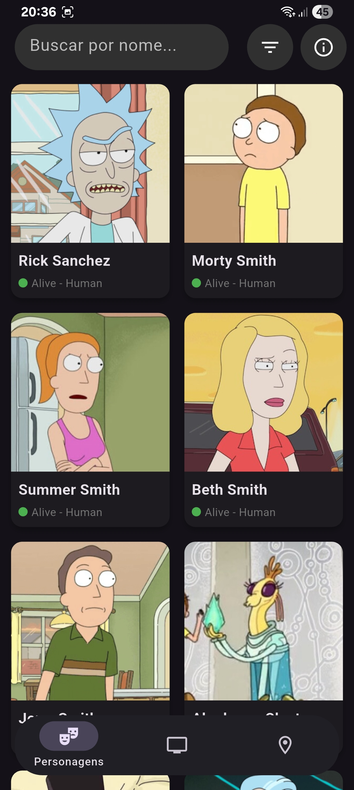
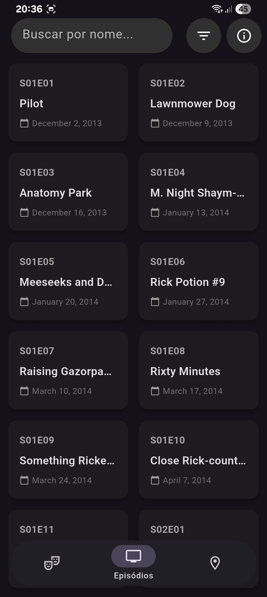
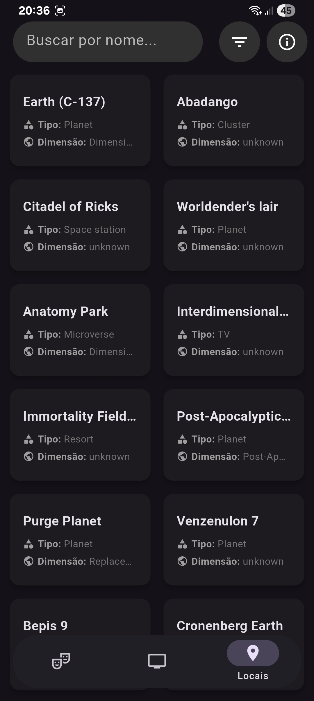

<p align="center">


# 🛸 Rick & Morty: Flutter Explorer

</p>

Wubba Lubba Dub Dub! This is a complete Flutter app to explore the Rick & Morty universe, allowing navigation, search and filtering for Characters, Episodes and Locations.

<p align="center">

  
  
  
  
</p>

## 📸 Screenshots

<details>
<summary>Characters</summary>



</details>
<details>
<summary>Episodes</summary>



</details>
<details>
<summary>Locations</summary>



</details>

## ✨ Features (The "What")

This app is not just a list, it's a full exploration system:

- **Tab Navigation:** Three main tabs (Characters, Episodes, Locations) controlled by a `TabController`.
- **Modern UI (Material 3):**
  - Floating, rounded navigation bar.
  - Search bar and filter buttons in the `AppBar` with cohesive, floating design.
- **Real-time Search:** A single `TextField` that filters results of the current tab.
  - **Debouncer:** Waits 500ms after the user stops typing to avoid unnecessary API calls.
- **Complete Filter System:**
  - A filter `IconButton` that opens a `ModalBottomSheet`.
  - The modal shows _contextual_ filters for each tab (e.g., Status, Gender and Species for Characters).
  - Filter selection updates state via Provider and reloads data.
- **Infinite Scroll (Pagination):**
  - Loads the first page and uses a `ScrollController` to detect the end of the list.
  - Calls `loadContent()` automatically to load pages 2, 3, 4...
- **Reactive State Management:**
  - Uses `Provider` to manage and notify the UI of changes.
  - `isLoading`, `errorMessage`, `hasNextPage` are all managed in `AppProvider`.
- **Error and Loading Handling:**
  - Shows a centered `CircularProgressIndicator` on first load.
  - Shows a friendly `buildErrorWidget` if the API fails (e.g., `SocketException` for "no internet").
  - Shows a `buildEmptyState` if search or filters return no results.
- **About Dialog:** An `AlertDialog` with team information and a GitHub link (using `url_launcher`).

## 🏗️ Architecture (The "How")

The architecture was the _highest impact lever_ of this project, focused on **Separation of Concerns (SoC)**.

### 1. Service Layer (`ApiService`)

- **Responsibility:** Be the _only_ part of the app that knows how to "talk" to the internet.
- **Function:** Handles `http`, building `Uri` (with all filter parameters), handling `statusCode` (including `404` for empty searches) and `json.decode`.
- _Knows nothing about UI or State._

### 2. State Layer (`AppProvider`)

- **Responsibility:** Be the "brain" and the _single source of truth_ for the whole app.
- **Function:** Uses `ChangeNotifier` (from `Provider`).
  - Holds UI state (lists `characters`, `episodes`, `locations`).
  - Holds pagination state (`currentPage`, `hasNextPage`, `isLoading`).
  - Holds filter state (`_searchQuery`, `_statusFilter`, `_genderFilter`, etc.).
  - Contains logic for `loadContent()`, `switchContentType()`, `_resetAndReload()` and filter setters.
- _Knows nothing about Widgets or HTTP._

### 3. Presentation Layer (`HomeScreen` and Widgets)

- **Responsibility:** Be "dumb" and just _react_ to state.
- **Function:**
  - **`HomeScreen`:** Builds the `Scaffold` and the `Controllers` (Tab, Scroll, Search).
  - **`Consumer<AppProvider>`:** Listens to changes in `AppProvider` and rebuilds the `GridView`.
  - **Widgets (`CharacterCard`, etc.):** Only receive data and display it.
- _Know nothing about business logic or where the data comes from._

This pattern (Service-State-UI) makes the app robust, easy to debug and very simple to scale (e.g., adding new filters).

## 🛠️ Technologies Used

- [**Flutter**](https://flutter.dev/) - The main UI framework.
- [**Provider**](https://pub.dev/packages/provider) - For reactive state management and dependency injection.
- [**http**](https://pub.dev/packages/http) - To make REST API calls.
- [**url_launcher**](https://pub.dev/packages/url_launcher) - To open the GitHub link in the browser.
- [**Rick & Morty API**](https://rickandmortyapi.com/) - The data source.

## 🚀 How to Run

You need the [Flutter SDK](https://flutter.dev/docs/get-started/install) installed.

1. **Clone the repository:**

  ```bash
    git clone https://github.com/BrunoKMagno/Flutter-RickAndMorty-APP.git
    cd Flutter-RickAndMorty-APP
  ```

2. **Install dependencies:**

  ```bash
    flutter pub get
  ```

3. **Run the app:**
  ```bash
    flutter run
  ```

## 👨‍💻 Team

- **Bruno Magno**
- **Leandro Oliveira**
- **Paulo de Araújo**
- **Marcelo Mesquita**

## 📄 License

This project is licensed under the MIT License. See the `LICENSE` file for details.

